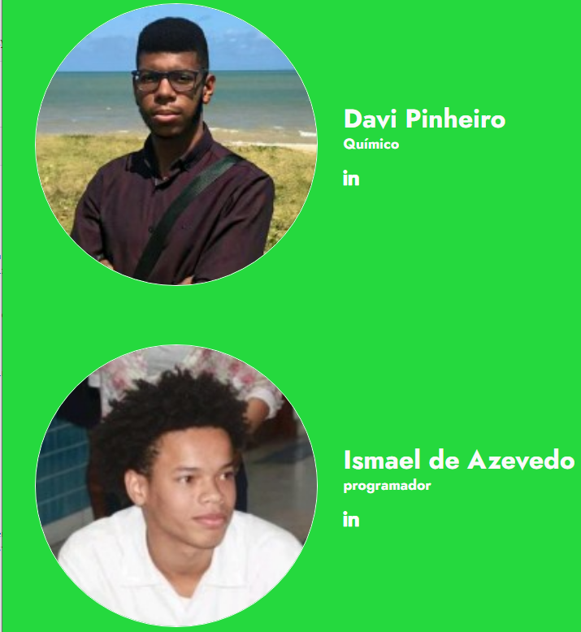
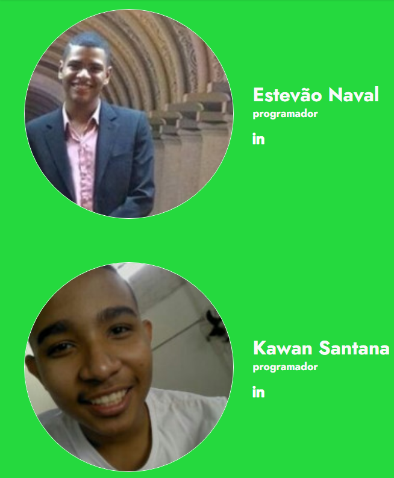
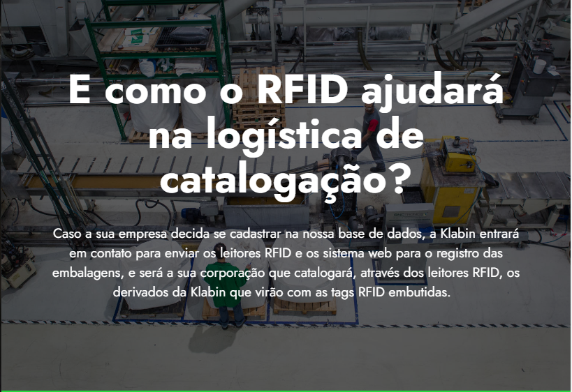
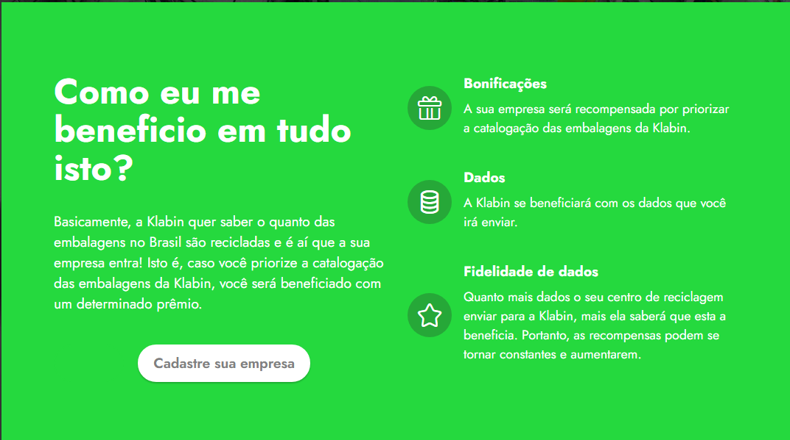
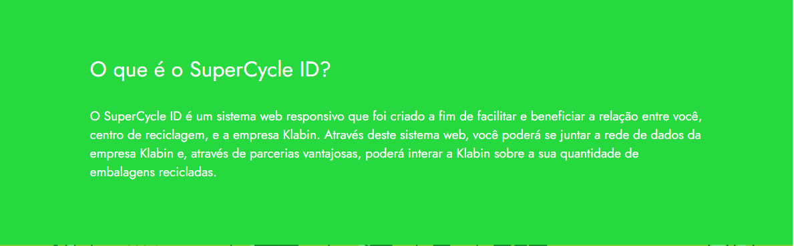
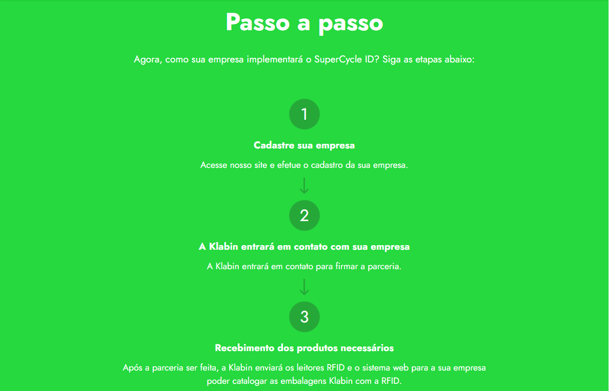
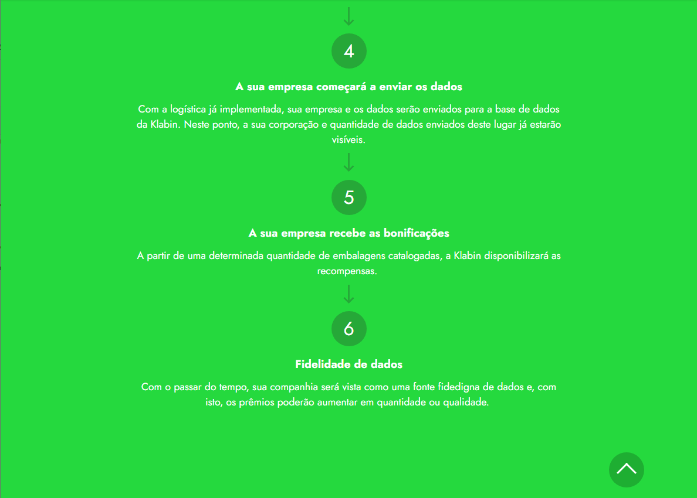

# SuperCycle ID

## Introdução
A Hacking Rio é uma hackaton, isto é, uma maratona de pogramação de dois dias e meio, no qual várias equipes disputam um determinado prêmio por meio da apresentação de soluções inovadoras, práticas, ageis e, se possível, de baixo custo para algum problema requerido. Além disto, também há um ganho indiscutível de experiências, networks e até novas amizades.  

Neste ano ocorreu nos dias 09, 10 e 11 de outubro de 2020, em meio a uma pandemia, a maior maratona de programação da América Latina, a Hacking Rio online.

## Nosso grupo

Nós, Estevão Naval, Ismael de Azevedo, Davi Pinheiro e Kawan Santana participamos, dentre muitos quesitos, no de sustentabilidade. Diriamos que foi um desafio em tanto, mas também valeu muito a pena. 

Nome do grupo: Apollo Solutions.

## Mas qual foi problema?

Em suma, a Klabin, a sponsor da categoria de sustentabilidade, é uma empresa de produção e reciclagem de papel e, estes precisavam de um meio para mensurar a quantidade papel deles que são reciclados, além de um meio para rastrea-los.

## Quais foram as suas soluções para o problema?

### Uso da tecnologia RFID
A nossa equipe, apollo solutins, primeiramente, decidiu por um meio mais tecnologico de resolver o problema e, para isto, nós utilizamos a tecnologia das tags RFID que estariam embutidas dentro de cada embalagem proveniente da Klabin.

#### O que é a tecnologia RFID?

### Como o RFID ajudará na logística de catalogação?

### Uma relação gamificada entre a Klabin e cada centro de reciclagem
É um fato irrefragável que nenhuma empresa mudaria algo seu a fim de fortalecer uma possível rival. Por conta disto, nós criamos o sistema web SuperCycle ID que pretende ajudar nas parcerias entre a Klabin e pontos de reciclagem a fim de beneficiar a ambos.

#### O que é o SuperCycle ID?

### Como tudo isto ocorrerá?

