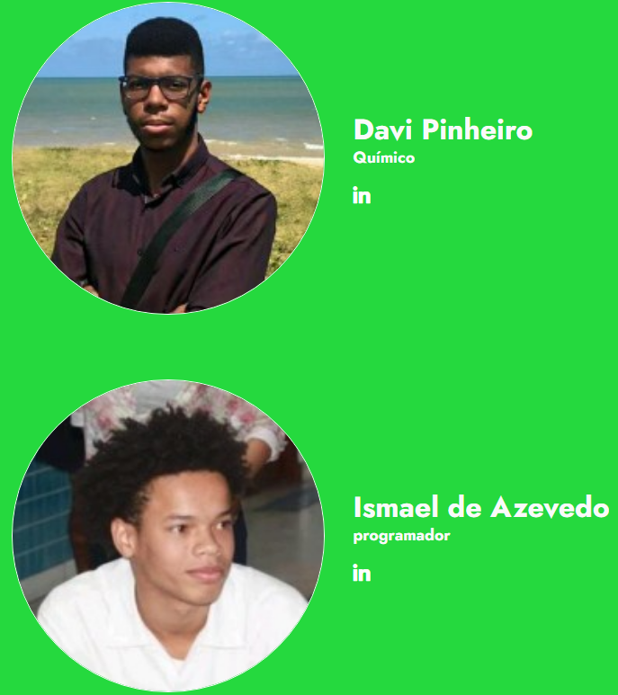
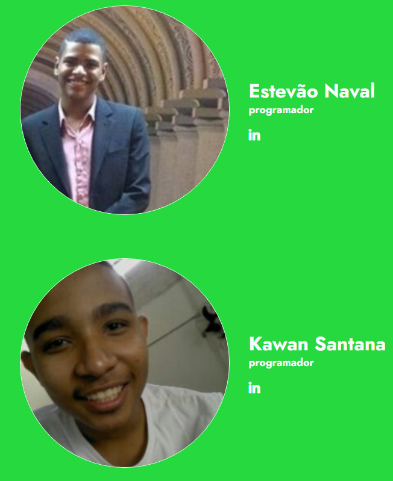

# SuperCycle ID

Um fato muito interessante aconteceu nos dias 09, 10 e 11 de outubro de 2020. Em meio a uma pandemia, ocorreu a maior maratona de programação da América Latina e nós estavamos lá!

## Nosso grupo

Nós, Estevão Naval, Ismael de Azevedo, Davi Pinheiro e Kawan Santana participamos, dentre muitos quesitos, no de sustentabilidade. Diriamos que foi um desafio em tanto, mas também valeu muito a pena. 

Nome do grupo: Apollo Solutions.

## Mas qual foi problema?

Em suma, a Klabin, a sponsor da categoria de sustentabilidade, é uma empresa de produção e reciclagem de papel e, estes precisavam de um meio para mensurar a quantidade papel deles que são reciclados, além de um meio para rastrea-los.

## Quais foram as suas soluções para o problema?

### Uso da tecnologia RFID
A nossa equipe, apollo solutins, primeiramente, decidiu por um meio mais tecnologico de resolver o problema e, para isto, nós utilizamos a tecnologia das tags RFID que estariam embutidas dentro de cada embalagem proveniente da Klabin.

### Uma relação gamificada entre a Klabin e cada centro de reciclagem

